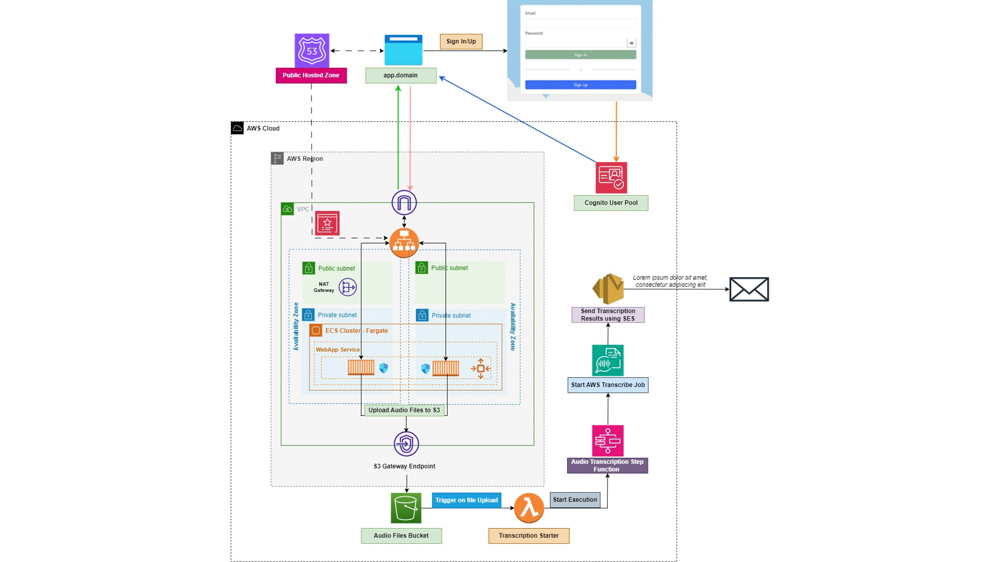

# Transcriber

Transcriber is a Simple Application that can be used to Transform your Audio Files into Text and sends back the results by email.

### Here's how it works :
  - **Upload Your Audio:** Easily upload your audio files directly to an S3 Bucket using a Web Application built with Angular Framework v16.2. The App is also integrated with Cognito for Authentication/Authorization purposes.
  - **Automatic Transcription:** Once uploaded, a Step Function is triggered to initiate the transcription process as shown in the below diagram.
  - **Results Delivered By Email:** After the Transcription process is completed, results will be delivered to your email.


To transform audio files, the Application is using different **AWS Services** as listed below :
- **Cognito**        : for Authentication/Authorization
- **S3**             : to upload the audio files to a dedicated S3 Bucket
- **Lambda**         : will be triggered everytime a new file is uploaded to the S3 Bucket and is used to start the execution of a **Step Function**
- **Step Functions** : used to manage the transcription life-cycle of a specific audion file
- **Transcribe**     : transform audio to text
- **SES**            : send transcription results via mail  

The below Diagram describes the App Infrastructure :



## What to excpect by deploying this terraform project ?
This project supports creating resources through individual sub-modules, it's mainly based on two main modules **global** and **regional** which you can find under the **factories** directory.

The **global** module is used to create non-region related resources "for example IAM Roles" while the **regional** module is used to create region related resources "for example an ALB or an ECS Cluster".

Under the **regional module** you can find a list of other terraform sub-modules (for example: ***vpc***, ***ecr*** and ***ecs***) which are needed to create the resources shown in the above diagram.

here is a list of the resources that will be created by each sub-module :

<!-- blank line -->
- [**VPC Sub-Module**](factories/regional/vpc):
    - A **Public Subnet** for each AZ in the **Primary** and the **Secondary** Regions based on the provided **VPC Cidr** [See Inputs](#inputs)
    - A **Private Subnet** for each AZ in the **Primary** and the **Secondary** Regions based on the provided **VPC Cidr** [See Inputs](#inputs)
    - An **Internet Gateway**
    - a **NAT Gateway** using one of the Public Subnets
    - a **Public Route Table** for Public Subnets
    - a **Private Route Table** for Private Subnets
    - **S3 & DynamoDB** Gateway Endpoints with their relative routes in both **Public & Private** Route Tables
<!-- blank line -->    
- [**ECR Sub-Module**](factories/regional/ecr) :
    - A **Private ECR Repository** named ***web-app-repo***
    - A Repo **Lifecycle rule** to keep the last tagged 30 images
    - **Docker** Build, Tag and Push for the **Transcriber** Web App that you can find [here](angular)
<!-- blank line -->    
- [**ECS Sub-Module**](factories/regional/ecs) :     
    - An **ECS Fargate Cluster** named ***APP-ECS-FARGATE***
    - A **Task Definition** using the **ECR Image** pushed by the **ECR Sub-Module**
    - Task Definition Role & Execution Role
    - An **ECS Service** using the created **Task Definition** and with **Autoscaling** enabled "Min Tasks=1 and Max Tasks=10"
    - An **Internet Facing ALB** for Service Public Exposure
    - A **Wild Card ACM Certificate** based on the provided **Public Domain Name** for **TLS Termination** [See Inputs](#inputs)
    - **DNS Validation** for the created Certificate
    - **Route53 Records** to route traffic to the Application Load Balancer
 <!-- blank line -->    
- [**Cognito Sub-Module**](factories/regional/cognito) :
    - Cognito **User Pool**
    - Cognito **Identity Pool**
    - Cognito **Identity Pool Authenticated IAM Role** ***"The IAM Role to be associated to Authenticated Users"***
<!-- blank line -->    
- [**S3 Sub-Module**](factories/regional/s3) :
    - **S3 Bucket**
    - **S3 Bucket** Policy
    - **S3 Lifecycle Rule** to delete Audio Files after 1 day
    - **A Lambda Function** that will be triggered each time a new file is uploaded to the S3 Bucket and needed to start the execution of the **Step Function**
<!-- blank line -->    
- [**Step Sub-Module**](factories/regional/step) :
    - Creates a **Step Function** with three different **Lambda Functions** needed to manage the **Transcription life-cycle** of the uploaded Audio File (for example: AWS Transcribe Job Creation/Deletion or Sending Transcription results via Email)
    - **A IAM Role** for each **Lambda Function** with the permissions needed to perform a specific action

<!-- blank line -->
## Prerequisites 

To be able to use this project, you will need the following : 
- A **Public Domain Name** registered or imported in **Route53**
- A **Verified SES Email Address** that will be used to send Transcription results

<!-- blank line -->
## Inputs 

The following inputs should be added to the [metadata.yml](metadata.yml)

|      **Input**     	| **Mandatory** 	| **Example**      	|                                                 **Description**                                                	|
|:------------------:	|:-------------:	|------------------	|:--------------------------------------------------------------------------------------------------------------:	|
| domain_name        	| TRUE          	| petereskandar.eu 	| The Public Domain Name needed for the App Public Exposure and ACM Certificate Validation                       	|
| domain_name_suffix 	| TRUE          	| webapp           	| Needed for DNS records creation to expose the App publicly,for example : webapp.petereskandar.eu               	|
| vpc_cidr           	| TRUE          	| 10.0.0.0/16      	| The VPC Cidr is required to setup the Networking part in each region "VPC, Public Subnets and Private Subnets" 	|
| sender_email           	| TRUE          	| info@petereskandar.eu      	| A Verified SES Email Address that will be used by the application to send transcription results 	|

<!-- blank line --> 
## Installation
  1. Clone the repo
     ```
     git clone https://github.com/petereskandar/transcriber.git
     ```
  2. Terraform Plan
     ```
     terraform plan
     ```
  3. Terraform Apply
     ```
     terraform apply
     ```
  4. Visit `"https://${domain_name_prefix}.${domain_name}"` based on your provided inputs
  5. The Following Web Page will be shown :
     <!-- blank line --> 
     
  6. **Sign Up** and then **Sign In** to be able to upload your Audio Files "only .mp3 and .mp4 are the accepted formats"
  7. Transcription results will be delivered by default to the email address you used during the sign up process otherwise you can insert a different email address during the upload of the Audio File
 


<!-- blank line --> 
****
**Any suggestions are much appreciated**
